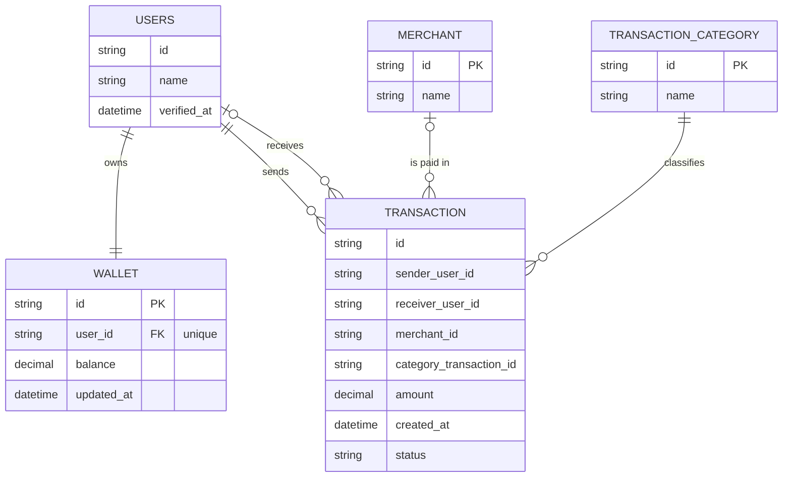

```mermaid
erDiagram
USERS ||--||WALLET: owns
TRANSACTION_CATEGORY ||--o{TRANSACTION:classifies
MERCHANT |o--o{ TRANSACTION : "is paid in"
USERS |o--o{TRANSACTION:"receives"
USERS ||--o{TRANSACTION:"sends"
WALLET {
  string id PK
  string user_id FK "unique"
  decimal balance
  datetime updated_at
}
USERS {
  string id
  string name
  datetime verified_at
}
TRANSACTION{
  string id
  string sender_user_id
  string receiver_user_id
  string merchant_id
  string category_transaction_id
  decimal amount
  datetime created_at
  string status
}
TRANSACTION_CATEGORY{
  string id PK
  string name
}
MERCHANT{
  string id PK
  string name
}

```
