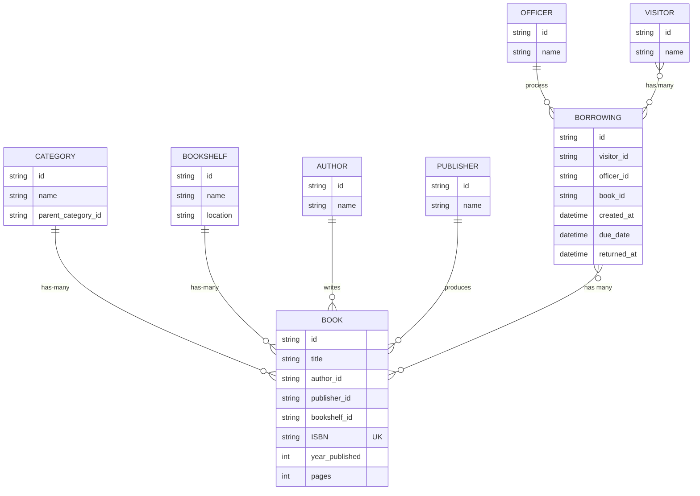

```mermaid
erDiagram
CATEGORY ||--o{BOOK: has-many
BOOKSHELF ||--o{BOOK:has-many
OFFICER ||--o{BORROWING: process
AUTHOR ||--o{BOOK:writes
PUBLISHER ||--o{BOOK:produces
VISITOR }o--o{BORROWING:"has many"
BORROWING }o--o{BOOK:"has many"
BOOK {
  string id
  string title
  string author_id
  string publisher_id
  string bookshelf_id
  string ISBN UK
  int year_published
  int pages
}
CATEGORY {
  string id
  string name
  string parent_category_id
}
BOOKSHELF{
  string id
  string name
  string location
}
OFFICER{
  string id
  string name
}
AUTHOR{
  string id
  string name
}
PUBLISHER{
  string id
  string name
}
VISITOR{
  string id
  string name
}
BORROWING{
  string id
  string visitor_id
  string officer_id
  string book_id
  datetime created_at
  datetime due_date
  datetime returned_at
}
```
